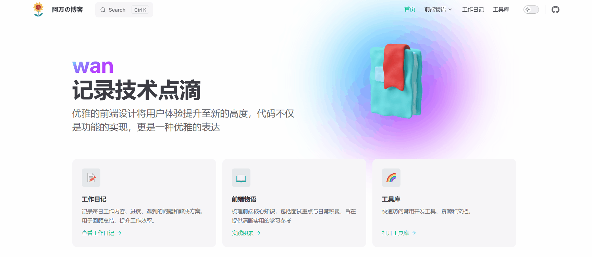

<p align="center">
  
</p>
<p align="center"> 基于 <b>VitePress</b> 的个人前端导航页面模板 😘</p>
<p align='center'>基础教程 | 作者博客</p>

---

## 预览地址

- https://hungerwl.github.io/wl-blob/

### 开启访客统计

需在 `docs/.vitepress/config.ts` 中配置 `themeConfig.visitor`

```ts
export default defineConfig({
  themeConfig: {
    /* 访客统计 */
    visitor: {
      /** 统计 id（单独页面的统计会作为前缀使用）*/
      badgeId: "",
    },
  },
});
```

### 开启 giscus 评论

需在 `docs/.vitepress/config.ts` 中配置 `themeConfig.comment`

```ts
export default defineConfig({
  themeConfig: {
    /**
     * giscus 评论配置
     *  请根据 https://giscus.app/zh-CN 生成内容填写
     */
    comment: {
      /** github 仓库地址 */
      repo: "",
      /** giscus 仓库 ID */
      repoId: "",
      /** Discussion 分类 */
      category: "",
      /** giscus 分类 ID */
      categoryId: "",
    },
  },
});
```
