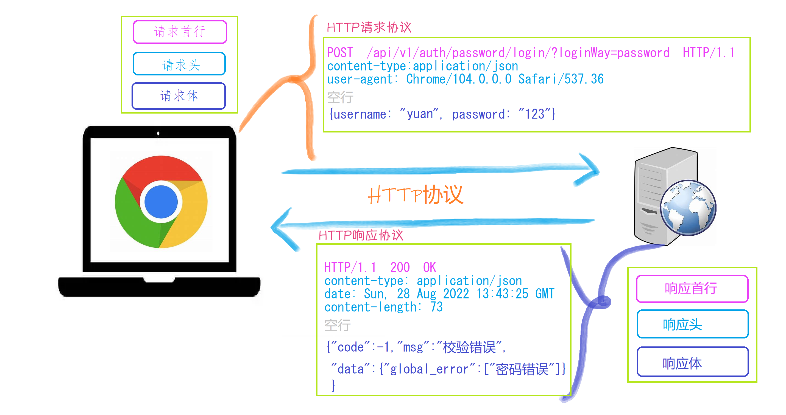
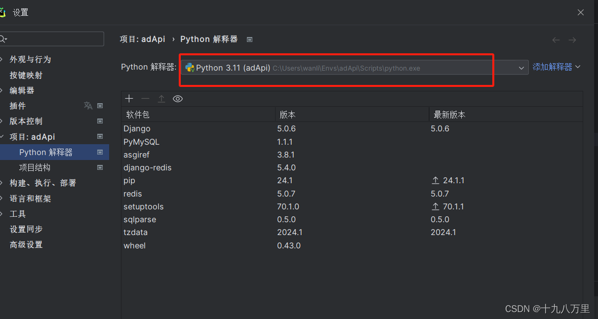
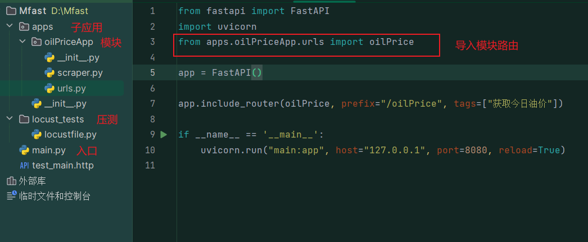
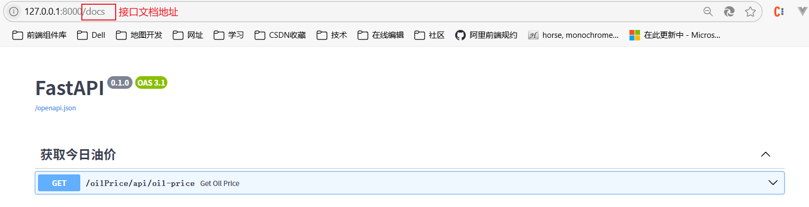
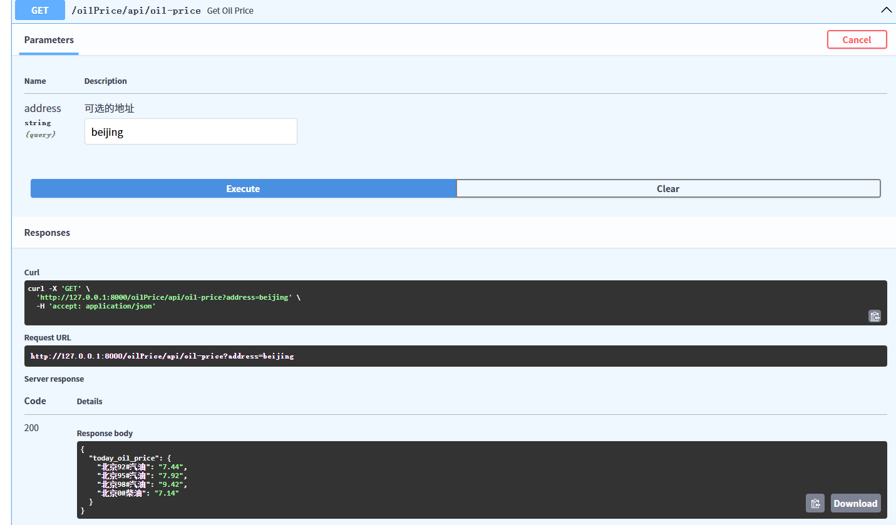
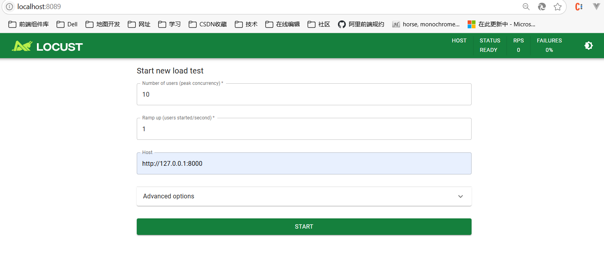
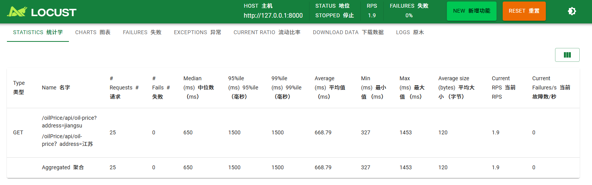

# FastApi框架
>一个用于构建 API 的现代、快速（高性能）的web框架

## 核心组件

> Starlette 一种轻量级的ASGI框架/工具包
>
> Pydantic 基于Python类型提示来定义数据验证、序列化和文档的库

## HTTP协议

## 快速构建

:::tip 关键词

虚拟环境创建，项目文件结构，路由分发，路径参数

:::

### （一）虚拟环境

~~~text
workon 查看当前有哪些虚拟环境
查看python解释器位置
windows系统：
where python
苹果系统：
which python
~~~

**相关命令**

~~~text
创建虚拟环境：                mkvirtualenv 虚拟环境名称
创建虚拟环境(指定python版本)： mkvirtualenv -p python3 虚拟环境名称
查看所有虚拟环境：             workon+2次tab键
使用虚拟环境：                workon 虚拟环境名称
退出虚拟环境：                deactivate
删除虚拟环境（必须先退出虚拟环境内部才能删除当前虚拟环境）:
                           	 rmvirtualenv 虚拟环境名称
    
其他相关命令：
查看虚拟环境中安装的包：              pip freeze  或者 pip list
收集当前环境中安装的包及其版本：       pip freeze > requirements.txt
在部署项目的服务器中安装项目使用的模块： pip install -r requirements.txt(重要文件)
``
提示：
- 虚拟环境只会管理环境内部的python模块和python解析器,对于源代码是毫无关系
- 创建虚拟环境需要联网
- 创建成功后, 会自动工作在这个虚拟环境上
- 工作在虚拟环境上, 提示符最前面会出现 “(虚拟环境名称)”
~~~

### （二）项目文件结构

### （三）路由分发

### （四）路径参数

### （五）示例

:::tip 获取今日油价

思路：根据爬取页面的目标地址，分析页面存储油价标签的元素标签，引入BeautifulSoup库，分析页面，抓取油价信息。

:::

~~~python
# scraper.py
import requests
from bs4 import BeautifulSoup

def fetch_oil_price(address):

    # 动态构建URL，地址作为路径的一部分
    url = f"http://xxxxx/{address}/"  # 根据传入的地址动态构建 URL

    headers = {
        "User-Agent": "Mozilla/5.0 (Windows NT 10.0; Win64; x64) AppleWebKit/537.36 (KHTML, like Gecko) "
                      "Chrome/115.0.0.0 Safari/537.36"
    }

    response = requests.get(url, headers=headers, timeout=5)

    response = requests.get(url)

    # 显式设置响应内容的编码为 GBK（针对国内网站的常见编码）
    response.encoding = 'gbk'

    response.raise_for_status()  # 检查请求是否成功

    soup = BeautifulSoup(response.text, 'html.parser')

    # cpbaojia标签存储油价信息
    exposition = soup.find("div", class_="cpbaojia")

    if not exposition:
        raise ValueError("未查询到油价信息")  # 未找到 class_ 为 cpbaojia 的父级元素

    # 找到包含油价的表格
    oil_price_table = exposition.find("table", width="98%")  # 通过宽度来定位表格，您可以根据实际情况修改选择器

    if not oil_price_table:
        raise ValueError("未找到油价表格")

    oil_prices = {}

    # 遍历表格中的所有行（跳过标题行）
    rows = oil_price_table.find_all("tr")[2:]  # 第一行是标题，第二行是日期，所以从第三行开始处理
    for row in rows:
        columns = row.find_all("td")
        if len(columns) >= 4:  # 确保每一行有至少4列
            fuel_name = columns[0].get_text(strip=True)  # 油品名称（如：江苏92#汽油）
            price = columns[1].get_text(strip=True)  # 价格
            oil_prices[fuel_name] = price

    return oil_prices
~~~

~~~python
# urls.py
from fastapi import APIRouter, HTTPException, Query
from .scraper import fetch_oil_price
from typing import Optional
from fastapi.responses import JSONResponse

oilPrice = APIRouter()

@oilPrice.get("/api/oil-price")
async def get_oil_price(address: Optional[str] = Query(None, description="可选的地址")):
    if not address:
        # 使用 JSONResponse 来返回自定义格式
        return JSONResponse(
            status_code=400,
            content={"errorMsg": "请输入想要查询省份小写拼英地址"}
        )
    try:
        # 将地址传递给爬取函数，获取对应的油价数据
        price = fetch_oil_price(address)
        return {"today_oil_price": price}
    except Exception as e:
        # 异常情况的自定义错误信息
        return JSONResponse(
            status_code=500,
            content={"errorMsg": f"获取油价失败: {str(e)}"}
        )
~~~

**压测**

~~~python
# locust_tests/locustfile.py
# 压测
from locust import HttpUser, task, between

class OilPriceUser(HttpUser):
    # 设置用户之间的等待时间，模拟间隔请求
    wait_time = between(1, 5)  # 等待 1-5 秒

    @task
    def get_oil_price(self):
        # 向你的 FastAPI 接口发送 GET 请求
        response = self.client.get("/oilPrice/api/oil-price?address=jiangsu")

        # 检查响应状态码是否为 200
        if response.status_code == 200:
            print("成功获取油价数据")
        else:
            print(f"请求失败: {response.status_code}")
~~~

