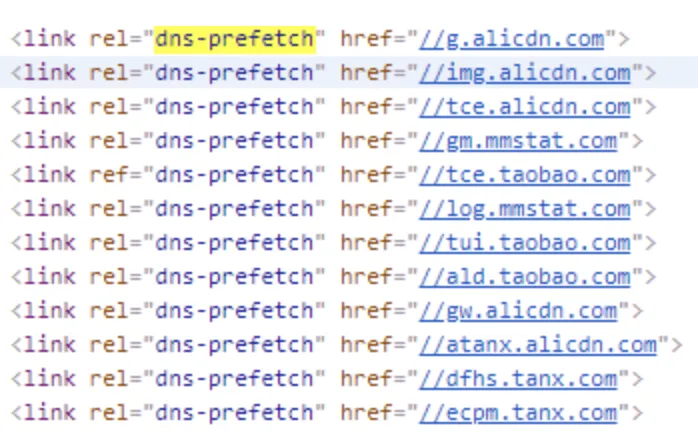

# HTML

## 1.HTML5 语义化

> [!TIP] 浏览器兼容  
> `<header>` `<footer>` `<article>` `<section>` `<nav>` `<aside>`  
> HTML5 新增的，旧版浏览器（如 Internet Explorer 8 及以下）无法识别这些标签。<br>
> 解决方案：下载引入 <a href="https://github.com/aFarkas/html5shiv" target="_blank">HTML5 Shiv</a>。

### 1. 结构性标签

- `<header>`：定义页面头部，通常包含网站导航、logo、标题等内容。
- `<nav>`：定义导航栏，用于包装导航链接。
- `<main>`：定义文档的主体内容，页面中唯一的主要内容区域。
- `<article>`：定义独立的内容块，可以是博客文章、新闻报道等。
- `<section>`：定义文档中的一个区域，通常用于按主题组织内容。
- `<aside>`：定义与主内容相关的边栏部分，常用于广告、相关链接等辅助内容。
- `<footer>`：定义页面或文章的页脚，通常包含版权信息、联系方式等。
- `<div>`：一个通用的容器元素，通常用于布局。

### 2. 文本相关标签

- `<h1>` 到 `<h6>`：定义标题，`<h1>` 为最高级标题，依此类推。
- `<p>`：定义段落。
- `<a>`：定义超链接。
- `<strong>`：表示强烈强调，通常显示为加粗文本。
- `<em>`：表示轻微强调，通常显示为斜体文本。
- `<blockquote>`：定义引用内容，通常用于引用外部文段。
- `<ul>`：定义无序列表。
- `<ol>`：定义有序列表。
- `<li>`：定义列表项。
- `<dl>`：定义描述列表。
- `<dt>`：定义描述列表中的术语。
- `<dd>`：定义描述列表中的定义。

### 3. 表格标签

- `<table>`：定义表格。
- `<tr>`：定义表格行。
- `<th>`：定义表格头部单元格。
- `<td>`：定义表格数据单元格。
- `<thead>`：定义表格的头部区域。
- `<tbody>`：定义表格的主体区域。
- `<tfoot>`：定义表格的脚部区域。

### 4. 表单相关标签

- `<form>`：定义表单。
- `<input>`：定义输入控件，常用于各种类型的输入。
- `<textarea>`：定义多行文本输入框。
- `<button>`：定义按钮。
- `<select>`：定义下拉框。
- `<option>`：定义下拉框中的选项。
- `<label>`：定义表单元素的标签。
- `<fieldset>`：用于分组相关表单元素，通常配合 `<legend>` 标签使用。
- `<legend>`：定义 `<fieldset>` 的标题或描述。

### 5. 媒体标签

- ``：定义图像。
- `<audio>`：定义音频内容。
- `<video>`：定义视频内容。
- `<source>`：为 `<audio>` 和 `<video>` 元素提供多个资源文件。
- `<track>`：为 `<video>` 和 `<audio>` 元素添加字幕、描述等。
- `<figure>`：定义图像、视频、图表等媒体内容。
- `<figcaption>`：定义 `<figure>` 的标题或描述。

### 6. 其他常见标签

- `<code>`：定义一段代码文本。
- `<pre>`：定义预格式化文本，通常用于显示代码块。
- `<time>`：定义时间或日期。
- `<mark>`：定义已高亮的文本。
- `<progress>`：表示任务的进度条。
- `<meter>`：表示一个度量的范围（例如：进度条、评分）。
- `<details>`：定义可展开和折叠的内容。
- `<summary>`：定义 `<details>` 标签的摘要部分。

## 2.meta 标签：自动刷新/跳转

假设要实现一个类似 PPT 自动播放的效果，你很可能会想到使用 JavaScript 定时器控制页面跳转来实现。但其实有更加简洁的实现方法，比如通过 meta 标签来实现：

```js
<meta http-equiv="Refresh" content="5; URL=page2.html">
```

上面的代码会在 5s 之后自动跳转到同域下的 page2.html 页面。我们要实现 PPT 自动播放的功能，只需要在每个页面的 meta 标签内设置好下一个页面的地址即可。

另一种场景，比如每隔一分钟就需要刷新页面的大屏幕监控，也可以通过 meta 标签来实现，只需去掉后面的 URL 即可：

```js
<meta http-equiv="Refresh" content="60">
```

**meta viewport 相关**

```js
<!DOCTYPE html>  <!--H5标准声明，使用 HTML5 doctype，不区分大小写-->
<head lang=”en”> <!--标准的 lang 属性写法-->
<meta charset=’utf-8′>    <!--声明文档使用的字符编码-->
<meta http-equiv=”X-UA-Compatible” content=”IE=edge,chrome=1″/>   <!--优先使用 IE 最新版本和 Chrome-->
<meta name=”description” content=”不超过150个字符”/>       <!--页面描述-->
<meta name=”keywords” content=””/>     <!-- 页面关键词-->
<meta name=”author” content=”name, email@gmail.com”/>    <!--网页作者-->
<meta name=”robots” content=”index,follow”/>      <!--搜索引擎抓取-->
<meta name=”viewport” content=”initial-scale=1, maximum-scale=3, minimum-scale=1, user-scalable=no”> <!--为移动设备添加 viewport-->
<meta name=”apple-mobile-web-app-title” content=”标题”> <!--iOS 设备 begin-->
<meta name=”apple-mobile-web-app-capable” content=”yes”/>  <!--添加到主屏后的标题（iOS 6 新增）
是否启用 WebApp 全屏模式，删除苹果默认的工具栏和菜单栏-->
<meta name=”apple-itunes-app” content=”app-id=myAppStoreID, affiliate-data=myAffiliateData, app-argument=myURL”>
<!--添加智能 App 广告条 Smart App Banner（iOS 6+ Safari）-->
<meta name=”apple-mobile-web-app-status-bar-style” content=”black”/>
<meta name=”format-detection” content=”telphone=no, email=no”/>  <!--设置苹果工具栏颜色-->
<meta name=”renderer” content=”webkit”> <!-- 启用360浏览器的极速模式(webkit)-->
<meta http-equiv=”X-UA-Compatible” content=”IE=edge”>     <!--避免IE使用兼容模式-->
<meta http-equiv=”Cache-Control” content=”no-siteapp” />    <!--不让百度转码-->
<meta name=”HandheldFriendly” content=”true”>     <!--针对手持设备优化，主要是针对一些老的不识别viewport的浏览器，比如黑莓-->
<meta name=”MobileOptimized” content=”320″>   <!--微软的老式浏览器-->
<meta name=”screen-orientation” content=”portrait”>   <!--uc强制竖屏-->
<meta name=”x5-orientation” content=”portrait”>    <!--QQ强制竖屏-->
<meta name=”full-screen” content=”yes”>              <!--UC强制全屏-->
<meta name=”x5-fullscreen” content=”true”>       <!--QQ强制全屏-->
<meta name=”browsermode” content=”application”>   <!--UC应用模式-->
<meta name=”x5-page-mode” content=”app”>   <!-- QQ应用模式-->
<meta name=”msapplication-tap-highlight” content=”no”>    <!--windows phone 点击无高亮
设置页面不缓存-->
<meta http-equiv=”pragma” content=”no-cache”>
<meta http-equiv=”cache-control” content=”no-cache”>
<meta http-equiv=”expires” content=”0″>
```

## 3.viewport

```html
<meta
  name="viewport"
  content="width=device-width,initial-scale=1.0,minimum-scale=1.0,maximum-scale=1.0,user-scalable=no"
/>
// width 设置viewport宽度，为一个正整数，或字符串‘device-width’ // device-width
设备宽度 // height
设置viewport高度，一般设置了宽度，会自动解析出高度，可以不用设置 //
initial-scale 默认缩放比例（初始缩放比例），为一个数字，可以带小数 //
minimum-scale 允许用户最小缩放比例，为一个数字，可以带小数 // maximum-scale
允许用户最大缩放比例，为一个数字，可以带小数 // user-scalable 是否允许手动缩放
```

:::tip 场景

怎样处理 移动端 1px 被 渲染成 2px 问题

:::

**局部处理**

- meta 标签中的 viewport 属性 ，initial-scale 设置为 1
- rem 按照设计稿标准走，外加利用 transfrome 的 scale(0.5) 缩小一倍即可；

**全局处理**

- mate 标签中的 viewport 属性 ，initial-scale 设置为 0.5
- rem 按照设计稿标准走即可

## 4.性能优化

:::warning 指标

渲染速度慢、请求时间长

:::

##### **1. script 标签：调整加载顺序提升渲染速度**

- 由于浏览器的底层运行机制，渲染引擎在解析 HTML 时，若遇到 script 标签引用文件，则会暂停解析过程，同时通知网络线程加载文件，文件加载后会切换至 JavaScript 引擎来执行对应代码，代码执行完成之后切换至渲染引擎继续渲染页面。
- 在这一过程中可以看到，页面渲染过程中包含了请求文件以及执行文件的时间，但页面的首次渲染可能并不依赖这些文件，这些请求和执行文件的动作反而延长了用户看到页面的时间，从而降低了用户体验。

**为了减少这些时间损耗，可以借助 script 标签的 3 个属性来实现。**

- async 属性。立即请求文件，但不阻塞渲染引擎，而是文件加载完毕后阻塞渲染引擎并立即执行文件内容

- defer 属性。立即请求文件，但不阻塞渲染引擎，等到解析完 HTML 之后再执行文件内容

- HTML5 标准 type 属性，对应值为“module”。让浏览器按照 ECMA Script 6 标准将文件当作模块进行解析，默认阻塞效果同 defer，也可以配合 async 在请求完成后立即执行。

  

绿色的线表示执行解析 HTML ，蓝色的线表示请求文件，红色的线表示执行文件

<span style="color:red">当渲染引擎解析 HTML 遇到 script 标签引入文件时，会立即进行一次渲染</span>。所以这也就是为什么构建工具会把编译好的引用 JavaScript 代码的 script 标签放入到 body 标签底部，因为当渲染引擎执行到 body 底部时会先将已解析的内容渲染出来，然后再去请求相应的 JavaScript 文件。

##### **2. link 标签：通过预处理提升渲染速度**

在我们对大型单页应用进行性能优化时，也许会用到按需懒加载的方式，来加载对应的模块，但如果能合理利用 link 标签的 rel 属性值来进行预加载，就能进一步提升渲染速度。

- dns-prefetch。当 link 标签的 rel 属性值为“dns-prefetch”时，浏览器会对某个域名预先进行 DNS 解析并缓存。这样，当浏览器在请求同域名资源的时候，能省去从域名查询 IP 的过程，从而减少时间损耗。下图是淘宝网设置的 DNS 预解
  
- preconnect。让浏览器在一个 HTTP 请求正式发给服务器前预先执行一些操作，这包括DNS 解析、TLS 协商、TCP 握手，通过消除往返延迟来为用户节省时间
- prefetch/preload。两个值都是让浏览器预先下载并缓存某个资源，但不同的是，prefetch 可能会在浏览器忙时被忽略，而 preload 则是一定会被预先下载。
- prerender。浏览器不仅会加载资源，还会解析执行页面，进行预渲染

## 5.如何高效操作DOM

#### 5.**1.线程切换**

- 浏览器为了避免两个引擎同时修改页面而造成渲染结果不一致的情况，增加了另外一个机制，这两个引擎具有互斥性，也就是说在某个时刻只有一个引擎在运行，另一个引擎会被阻塞。操作系统在进行线程切换的时候需要保存上一个线程执行时的状态信息并读取下一个线程的状态信息，俗称上下文切换。而这个操作相对而言是比较耗时的
- 每次 DOM 操作就会引发线程的上下文切换——从 JavaScript 引擎切换到渲染引擎执行对应操作，然后再切换回 JavaScript 引擎继续执行，这就带来了性能损耗。单次切换消耗的时间是非常少的，但是如果频繁地大量切换，那么就会产生性能问题

比如下面的测试代码，循环读取一百万次 DOM 中的 body 元素的耗时是读取 JSON 对象耗时的 10 倍。

~~~js
// 测试次数：一百万次
const times = 1000000
// 缓存body元素
console.time('object')
let body = document.body
// 循环赋值对象作为对照参考
for(let i=0;i<times;i++) {
  let tmp = body
}
console.timeEnd('object')// object: 1.77197265625ms

console.time('dom')
// 循环读取body元素引发线程切换
for(let i=0;i<times;i++) {
  let tmp = document.body
}
console.timeEnd('dom')// dom: 18.302001953125ms
~~~

#### **5.2重新渲染**

另一个更加耗时的因素是元素及样式变化引起的再次渲染，在渲染过程中最耗时的两个步骤为重排（Reflow）与重绘（Repaint）。

浏览器在渲染页面时会将 HTML 和 CSS 分别解析成 DOM 树和 CSSOM 树，然后合并进行排布，再绘制成我们可见的页面。如果在操作 DOM 时涉及到元素、样式的修改，就会引起渲染引擎重新计算样式生成 CSSOM 树，同时还有可能触发对元素的重新排布和重新绘制

- 可能会影响到其他元素排布的操作就会引起重排，继而引发重绘

- - 修改元素边距、大小
  - 添加、删除元素
  - 改变窗口大小

- 引起重绘

- - 设置背景图片
  - 修改字体颜色
  - 改变 visibility属性值

了解更多关于重绘和重排的样式属性，可以参看这个网址：[https://csstriggers.com/(opens new window)](https://csstriggers.com/)。

:::tip 示例

比如说要创建 1 万个 div 元素，在循环中直接创建再添加到父元素上耗时会非常多。如果采用字符串拼接的形式，先将 1 万个 div 元素的 html 字符串拼接成一个完整字符串，然后赋值给 body 元素的 innerHTML 属性就可以明显减少耗时

:::

~~~js
const times = 10000;
console.time('createElement')
for (let i = 0; i < times; i++) {
  const div = document.createElement('div')
  document.body.appendChild(div)
}
console.timeEnd('createElement')// 54.964111328125ms
console.time('innerHTML')
let html=''
for (let i = 0; i < times; i++) {
  html+='<div></div>'
}
document.body.innerHTML += html // 31.919921875ms
console.timeEnd('innerHTML')
~~~

