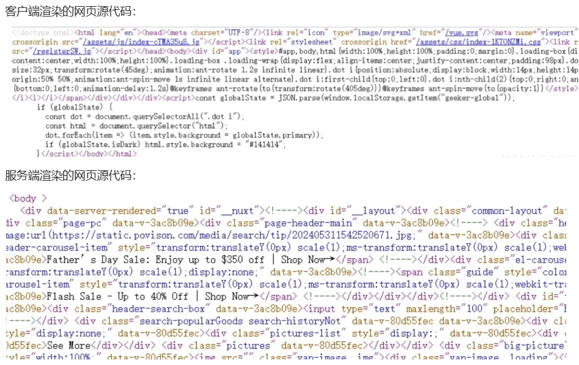

# 🙌 前端如何把 SEO 做到极致

### 1. TDK

TDK 是 Title(标题)、Description（描述）和 Keywords（关键词）的缩写，TDK 是一个网站 SEO 的核心。

因为滥用等原因，目前各大主流搜索引擎基本都已经降低甚至移除了 `keywords` 对排名的影响，TDK 的设置如下：

```js
<title>标题</title>
<meta name="description" content="描述">
<meta name="keywords" content="关键词">
```

### 2. Meta 标签的使用

Meta 标签是网页 head 区的辅助性标签，它的作用是经过配置一些参数用以描述页面属性，目前几乎所有搜索引擎都使用网上机器人自动查找 Meta 值来给网页分类。Meta 标签的 name 属性有以下配置项：

- Keywords：逗号分隔的关键词列表
- description：很重要，搜索引擎会把这个描述显示在搜索结果中
- format-detection：格式检测，比如禁止识别电话，邮箱等
- Robots：用来告诉搜索机器人哪些页面需要索引，哪些页面不需要索引
- theme-color：网站主题色

### 3. HTML 语义化

我们在开发的时候习惯性的通篇使用 div 和 span，这样其实是不利于 SEO 的，需要慢慢养成使用具有语义化标签的习惯，HTML 语义化有利于 SEO，使得搜索引擎更容易理解语义化页面的内容结构和主题。下面介绍一些常见语义化标签的使用以及注意事项：

**标题标签：**`h1、h2、h3、h4、h5 和 h6`，一个页面中最好保证只有一个 h1 标签，其他的标签根据实际情况使用

**强调标签：**`strong、em`，一方面是强调（加粗/斜体），增加了权重；另一方面增强视觉效果

**图片标签：** 使用时加上 `alt` 属性对图片进行描述，可以帮助蜘蛛快速理解图片的具体内容

**段落标签：** 页面中段落文字可使用 `p` 标签替代

**列表标签：**`ul、ol、li`，搜索引擎能够通过这些标签更好地理解信息的层次结构和关联性，从而更准确地评估网页的内容和价值

**布局标签：**`header、nav、article、section、aside、footer`，根据页面的区域模块划分选择对应的布局标签

### 4. Open Graph 协议

Open Graph 协议可以让任何一个网页集成到社交图谱中。例如，你的网页集成了 Open Graph 协议，按照协议加入了网页的标题，描述以及图片信息等，那么在 facebook 中分享这个网页的时候，facebook 就会按照你定义的内容来展示这个网页。

这个协议其实很简单，主要是通过在 html 中加入一些元数据（meta）标签来实现，property 属性以 og 开头，后面跟着具体属性，content 里面是属性的值

```html
<html prefix="og: http://ogp.me/ns#">
  <head>
    <title>The Rock (1996)</title>
    <meta property="og:title" content="The Rock" />
    <meta property="og:type" content="video.movie" />
    <meta property="og:url" content="http://www.imdb.com/title/tt0117500/" />
    <meta
      property="og:image"
      content="http://ia.media-imdb.com/images/rock.jpg"
    />
    ...
  </head>
  ...
</html>
```

### 5. HTML lang

设置 HTML 标签的 `lang` 属性主要用于指定网页内容的语言。这个属性对于搜索引擎优化（SEO）是有益的，因为它帮助搜索引擎了解页面内容的语言，从而能够更准确地将页面呈现给搜索特定语言内容的用户。对于国际化的项目，设置 `lang` 属性很有必要，搜索引擎能够将页面准确地展示给搜索相应语言的用户。

### 6. 服务端渲染

由于爬虫只能抓取到网页的静态源代码，而无法执行其中的 js 脚本，当网站采用 Vue 构建的单页面应用时，实际上是采用客户端渲染的方式，页面上的大部分 DOM 元素是在客户端通过 JavaScript 动态生成的。

客户端渲染的过程是需要时间的，爬虫不会等你渲染好，因此爬虫能够直接抓取和分析的内容会大幅减少。下面来看下客户端渲染和服务端渲染网页源代码的区别：



通过这两张图很明显可以看出，服务端渲染源代码的 body 里面是有很多标签元素的，这是因为在服务端时已经生成较完整的 html 代码,当网站采用服务端渲染的方式，蜘蛛去爬取网站源代码时，可以获取到更多的内容，有利于 SEO 的优化。现在很多的官网项目都已经采用 Vue + Nuxt 来实现，服务端渲染已经成为了一种趋势！

### 7. sitemap 站点地图

Sitemap，即站点地图，它是一个网站的全部URL列表，它的作用是向搜索引擎提供关于网站的信息，帮助搜索引擎更好地索引网站内容，提高网站在搜索结果中的排名，为了保证链接的全面性和准确性，应该自动不定期更新 sitemap 站点地图。

sitemap.xml 文件内容格式大致如下：

~~~xml
<?xml version="1.0" encoding="UTF-8"?>
<urlset xmlns="http://www.sitemaps.org/schemas/sitemap/0.9">
  <url>
    <loc>https://www.example.com/</loc>
    <lastmod>2023-04-26T18:23:17+00:00</lastmod>
    <changefreq>daily</changefreq>
    <priority>1.0</priority>
  </url>
  <url>
    <loc>https://www.example.com/about</loc>
    <lastmod>2023-04-25T10:12:14+00:00</lastmod>
    <changefreq>monthly</changefreq>
    <priority>0.8</priority>
  </url>
</urlset>
~~~

在这个示例中，每个 URL 元素代表网站中的一个页面，其中 元素包含页面的 URL 地址， 元素包含页面的最后修改时间，元素包含页面的更新频率，元素包含页面的优先级。

Sitemap 文件通常位于网站的根目录下，网站管理员可以在各个搜索引擎的站点平台提交 sitemap.xml 文件，以帮助搜索引擎更好地索引网站内容，例如：www.example.com/sitemap.xml

搜索引擎通过网络爬虫来索引网站内容，爬虫会首先访问网站的 sitemap.xml 文件，获取网站中所有页面的链接。搜索引擎会根据 sitemap.xml 文件提供的信息来判断页面的更新频率、优先级等，进而决定何时重新爬取网站页面，以保证搜索结果的准确性和时效性。

### 8. robots 文件

蜘蛛在访问一个网站时，会首先会检查该网站的根域下是否有一个叫做 robots.txt 的纯文本文件，这个文件用于指定 spider 在您网站上的抓取范围，[掘金的robots文件：https://juejin.cn/robots.txt](https://juejin.cn/robots.txt)

robots.txt 文件由键值对组成：其中 `User-agent` 用于描述搜索引擎蜘蛛的名字；`Disallow` 用于描述不希望被访问到的一个 URL，一个目录或者整个网站，具体的用法如下：

~~~js
*网站目录下所有文件均能被所有搜索引擎蜘蛛访问*
  User-agent: *
Disallow:

*禁止所有搜索引擎蜘蛛访问网站的任何部分*
  User-agent: *
Disallow: /

*禁止所有的搜索引擎蜘蛛访问网站的几个目录*
  User-agent: *
Disallow: /haha/

  *只允许某个搜索引擎蜘蛛访问*
  User-agent: Googlebot
Disallow:
~~~

该文件中还可以配置 `Sitemap` 属性，用于提供网站 sitemap 的 URL 地址，帮助搜索引擎爬虫更有效地发现和索引这些页面：

~~~js
User-Agent: *
Disallow: /private/

Sitemap: https://xxxx.com/sitemap.xml
~~~

在项目中我们只需将 `robots.txt` 文件上传到网站根目录就行了，注意文件名一定要全小写，然后通过 `域名/robots.txt` 进行访问。

### 9. 使用HTTPS

谷歌曾发公告表示，使用 HTTPS 是搜索引擎排名的一项参考因素，HTTPS 站点相比于 HTTP 站点，能获得更好的排名。


